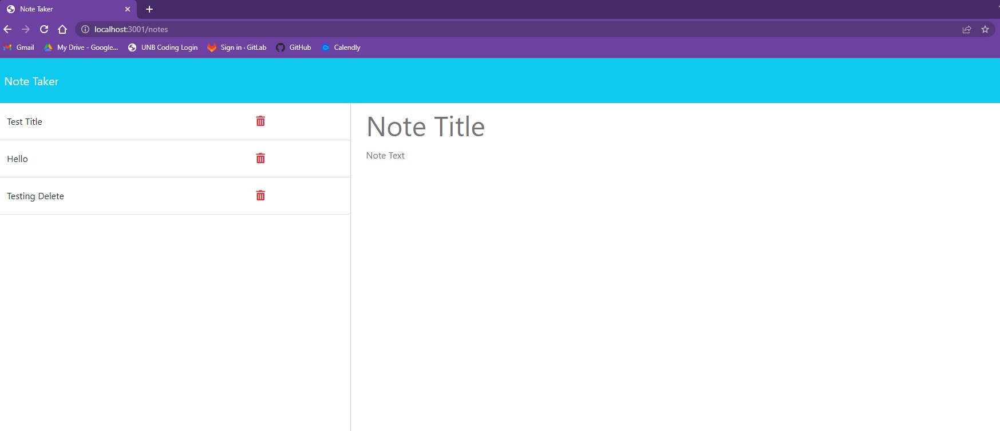

# WEEK-11-CHALLENGE-NOTE-TAKER

  

  ## Table of Contents

  - [Description](#description)
  - [Deployment](#deployment)
  - [Screenshoot](#screenshot)
  - [Questions](#questions)
  - [Credits](#credits)
  - [License](#license)

    
  ## Description
  
  A note taker app that allows the user to enter, save and delete notes.

  ## Deployment 
  
  The app is being deployed via Heroku at: https://rocky-hamlet-13032.herokuapp.com/

  ## Screenshot
 
  

  ## Questions
  CONTACT: Amanda Lacroix
  EMAIL: amanda_lacroix@hotmail.com
  REPO: https://github.com/Amanda-Lacroix/WEEK-11-CHALLENGE-NOTE-TAKER

  ## Credits
 - Starter code provided by: https://git.bootcampcontent.com/new-brunswick/UNB-VIRT-FSF-PT-01-2023-U-LOLC
 

  ## License
  [MIT]( https://opensource.org/licenses/MIT)
